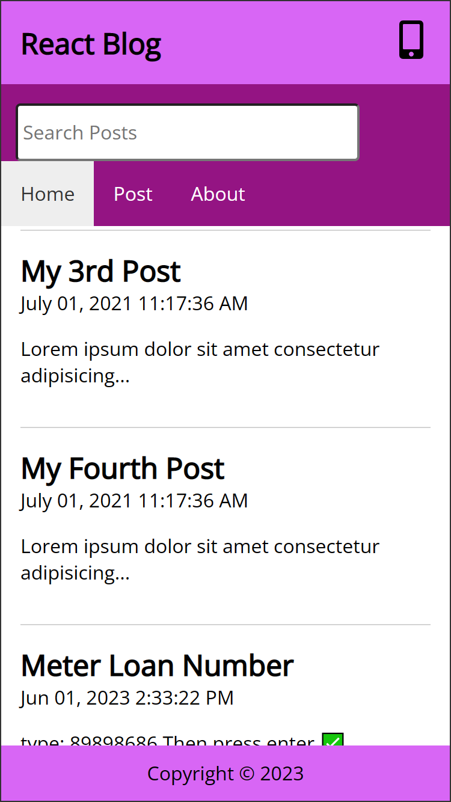
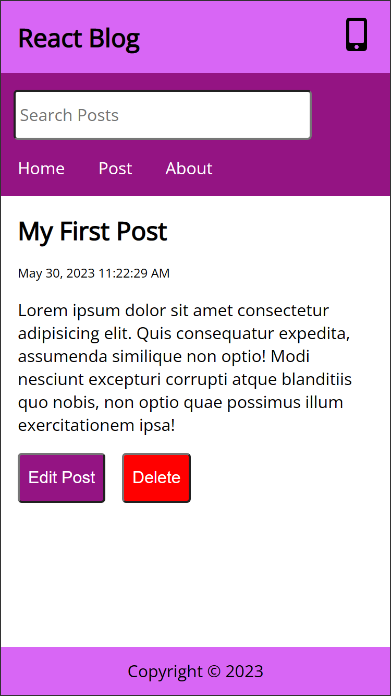
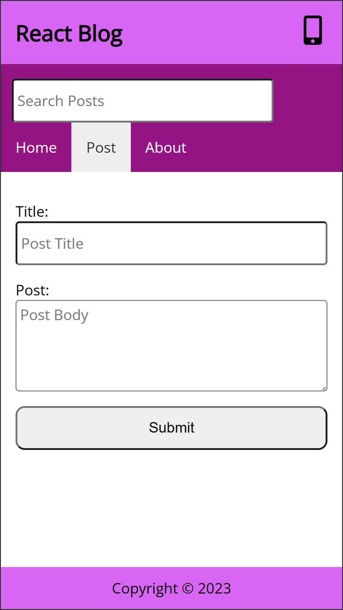
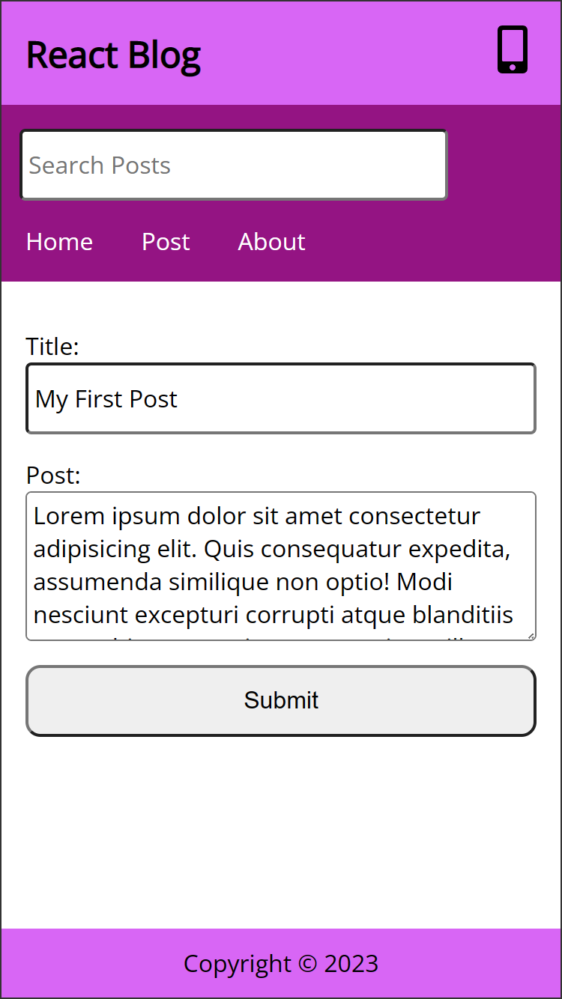

# React Blogging Website 🦄

## Home Page

## Post View Page

## Create Post Page

## Edit Post Page

## How to run this app on local machine

**This app is used ViteJS for runnig ReactJS**
For running this app write in terminal `npx json-server -p 3000 -w db/db.json` and `npx vite --port=4000`. It will run on port 4000. [http://localhost:4000/](http://localhost:4000/)
